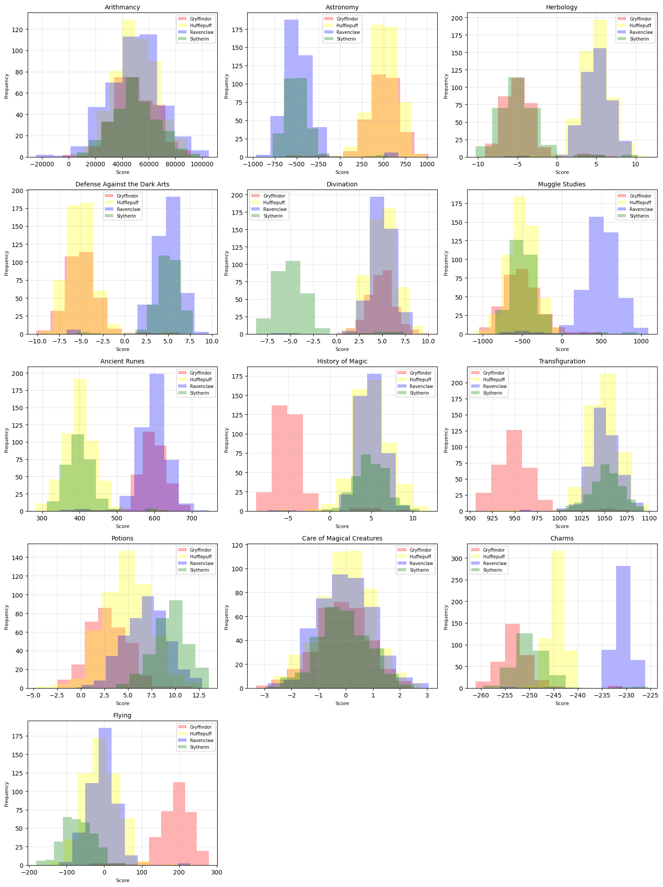
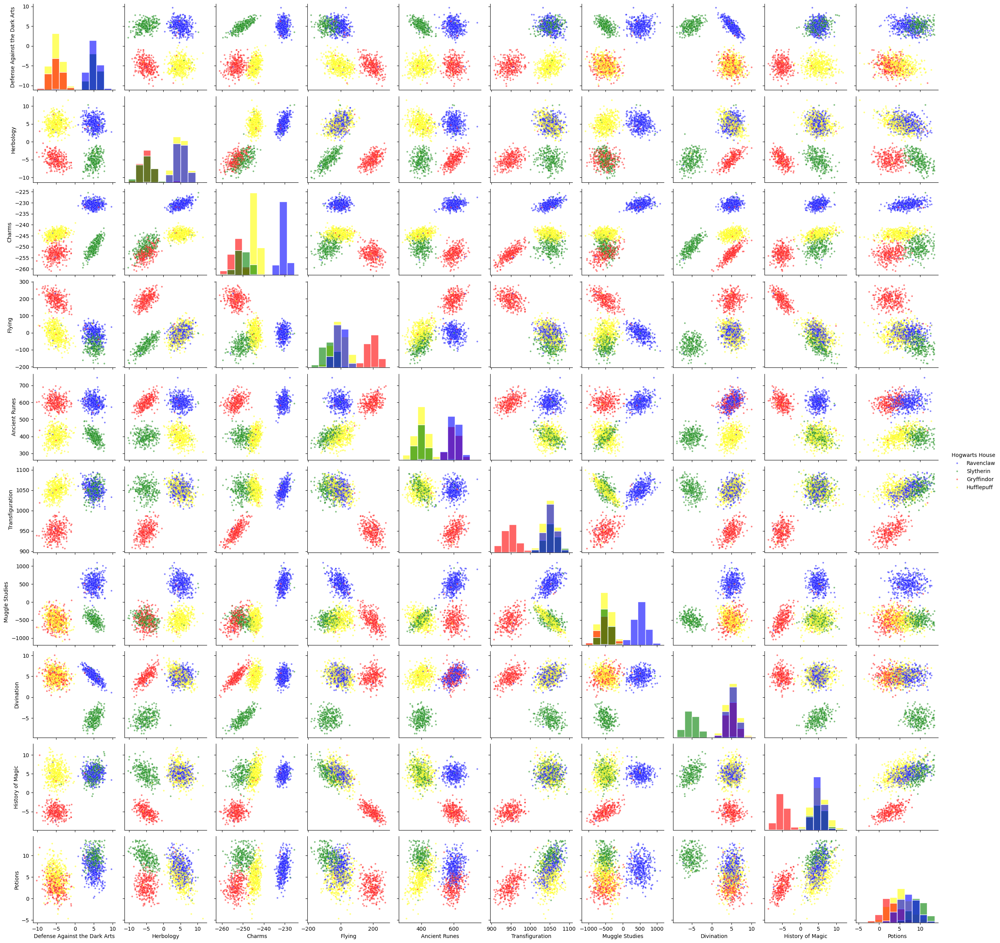
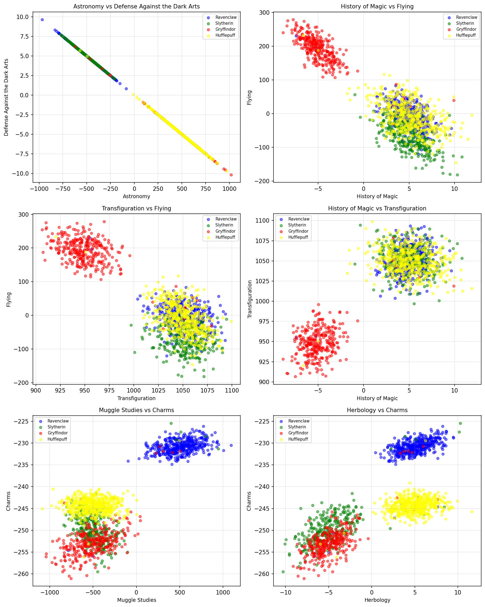
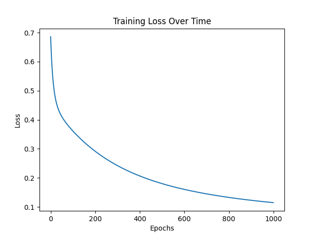

# DSLR – Data Analysis Project

A data analysis project inspired by the Hogwarts dataset, focusing on exploring and understanding data using Python.

## Overview

This project involves analyzing a dataset of student information and applying basic data science techniques to extract insights.

The goal is to understand patterns in the data and build simple models to support classification tasks.

## Features

- Data exploration and visualization
- Statistical analysis of features
- Basic data cleaning and preprocessing
- Implementation of simple machine learning logic

## Tech Stack

- Python
- NumPy
- Pandas
- Matplotlib

## What I Learned

- Working with real-world datasets
- Understanding data distributions and correlations
- Cleaning and preparing data for analysis
- Implementing algorithms step by step

## How to Run

Clone the repository:

```bash
git clone https://github.com/xchen34/dslr.git
cd dslr

Install dependencies:

pip install -r requirements.txt

## How to Run

Install dependencies:

```bash
pip install -r requirements.txt
```

### Run the analysis scripts

```bash
python describe.py dataset_train.csv
python histogram.py dataset_train.csv
python scatter_plot.py dataset_train.csv
python pair_plot.py dataset_train.csv
```

### Train the logistic regression model

```bash
python logreg_train.py dataset_train.csv
```

### Run predictions on the test dataset

```bash
python logreg_predict.py dataset_test.csv
```

## Visualizations

### Data Distribution


### Feature Relationships


### Correlation Example


### Training Process


## Notes

This project is part of my learning journey in data analysis and machine learning fundamentals.

It focuses on understanding algorithms from scratch rather than relying on high-level libraries.
